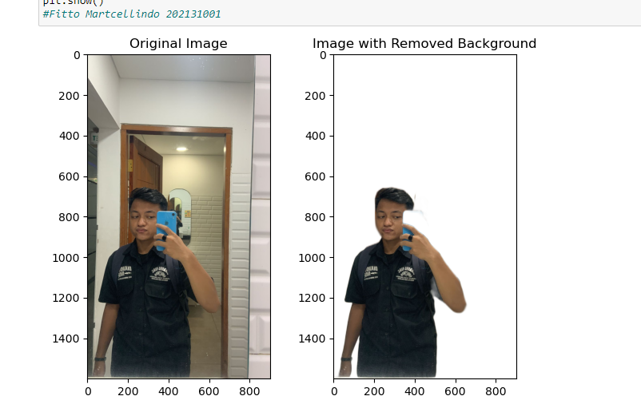

# Remove Background

from rembg import remove // import libary rembg
from PIL import Image

input_path = 'buah.jpg' //pengen file gambar 
output_path = 'newBuah.png' //export to png

input_image = Image.open(input_path)
output_image = remove(input_image)
output_image.save(output_path) // save file pada folder default

// show image after and before remove

import matplotlib.pyplot as plt //libary plotlib 

input_path = 'buah.jpg'
output_path = 'newBuah.png'

# Buka gambar asli
input_image = Image.open(input_path)

# Tampilkan gambar asli sebelum penghapusan latar belakang
plt.subplot(1, 2, 1)
plt.imshow(input_image)
plt.title('Original Image')

# Hapus latar belakang
output_image = remove(input_image)

# Tampilkan gambar setelah penghapusan latar belakang
plt.subplot(1, 2, 2)
plt.imshow(output_image)
plt.title('Image with Removed Background')

# Simpan gambar yang telah dihapus latar belakang
output_image.save(output_path)

# Tampilkan plot
plt.tight_layout()
plt.show()

// hasil output


## Screenshots


!(https://via.placeholder.com/468x300?text=App+Screenshot+Here)


## Acknowledgements

 - [Awesome Readme Templates](https://awesomeopensource.com/project/elangosundar/awesome-README-templates)
 - [Awesome README](https://github.com/matiassingers/awesome-readme)
 - [How to write a Good readme](https://bulldogjob.com/news/449-how-to-write-a-good-readme-for-your-github-project)


## screen shoot


## Teori Remove Background
Teori remove background pada pengolahan citra adalah suatu teknik yang digunakan untuk menghapus latar belakang (background) pada sebuah citra dan mempertahankan objek utama (foreground) yang ada dalam citra tersebut. Tujuan dari teknik ini adalah untuk memisahkan objek dari latar belakang sehingga objek tersebut dapat digunakan atau dianalisis secara terpisah.

Salah satu metode yang umum digunakan untuk remove background pada pengolahan citra adalah penggunaan segmentasi citra berdasarkan warna atau intensitas. Metode ini mengasumsikan bahwa objek dan latar belakang memiliki perbedaan warna atau intensitas yang signifikan.

Berikut adalah langkah-langkah umum dalam mengimplementasikan teknik remove background menggunakan Jupyter Notebook dengan Python:

1. Import Library: Pertama-tama, Anda perlu mengimpor beberapa library yang diperlukan, seperti OpenCV dan NumPy. OpenCV adalah library komputer vision yang populer, sedangkan NumPy adalah library untuk operasi matriks dan array multidimensi.

```python
import cv2
import numpy as np
```

2. Baca Citra: Selanjutnya, baca citra yang ingin Anda hapus latar belakangnya.

```python
image = cv2.imread('nama_file_citra.jpg')
```

3. Konversi ke HSV: Konversikan citra dari ruang warna BGR (Blue-Green-Red) ke HSV (Hue-Saturation-Value). Ruang warna HSV lebih sering digunakan dalam segmentasi warna karena memisahkan informasi warna dari kecerahan.

```python
hsv_image = cv2.cvtColor(image, cv2.COLOR_BGR2HSV)
```

4. Tentukan Range Warna: Tentukan rentang warna yang ingin Anda pilih sebagai objek utama. Anda dapat menggunakan fungsi inRange() pada citra HSV untuk mengidentifikasi piksel-piksel yang berada dalam rentang warna yang ditentukan.

```python
lower_color = np.array([h_min, s_min, v_min])
upper_color = np.array([h_max, s_max, v_max])
mask = cv2.inRange(hsv_image, lower_color, upper_color)
```

Anda perlu menentukan nilai-nilai h_min, s_min, v_min sebagai batas bawah rentang warna yang ingin Anda pilih, serta h_max, s_max, v_max sebagai batas atas rentang warna tersebut.

5. Aplikasikan Mask: Gunakan mask yang dihasilkan untuk menghapus latar belakang dalam citra awal. Anda dapat menggunakan bitwise_and() untuk menggabungkan citra asli dengan mask.

```python
result = cv2.bitwise_and(image, image, mask=mask)
```

6. Tampilkan Hasil: Tampilkan citra hasil yang telah dihapus latar belakangnya.

```python
cv2.imshow('Hasil', result)
cv2.waitKey(0)
cv2.destroyAllWindows()
```

7. Simpan Hasil: Jika Anda ingin menyimpan citra hasil, Anda dapat menggunakan fungsi imwrite().

```python
cv2.imwrite('hasil_remove_background.jpg', result)
```

Itulah penjelasan tentang teori remove background pada pengolahan citra menggunakan Jupyter Notebook dengan Python. Anda dapat menggabungkan langkah-langkah ini dan menyesuaikannya sesuai kebutuhan Anda.